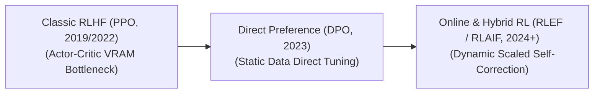

# Awesome-RLHF 🚀 🧠

## Reinforcement Learning from Human Feedback (RLHF): Evolution, Variants, & Applications

Reinforcement Learning from Human Feedback (RLHF) is a machine learning paradigm designed to align Large Language Models (LLMs) with human intent, safety boundaries, and qualitative expectations. Traditional training tasks (like next-token prediction) only teach a model how to mimic text patterns; they do not explicitly teach it how to be helpful, harmless, and honest. RLHF bridges this gap by using human evaluators to score model behaviors, training a secondary system to replicate that human judgment, and optimization-tuning the base model using reinforcement learning loops.

---

## 1. The Chronological Evolution

The architectural progression of RLHF reflects a steady structural push away from heavy multi-model computational pipelines toward streamlined direct preference functions and token-level optimization loops.

| Phase / Variant | Concept / Behavior | Significance / Limitations | Year | Paper Link |
|---|---|---|---|---|
| **[The Actor-Critic Foundation (PPO Era, ~2019–2022)](pages/actor-critic-foundation.md)** | *Concept:* Popularized by OpenAI (InstructGPT). It utilizes a three-stage pipeline: Supervised Fine-Tuning (SFT), training an explicit secondary Reward Model on pairwise human labels, and optimizing the LLM using **Proximal Policy Optimization (PPO)** against that reward signal. | *Limitation:* Requires keeping up to four massive models in VRAM concurrently (Actor, Critic, Reference, and Reward), making it highly volatile and resource-intensive to scale. | 2022 | [InstructGPT](https://arxiv.org/abs/2203.02155) |
| **[The Non-RL Direct Preference Shift (DPO Era, ~2023–2024)](pages/dpo-era.md)** | *Concept:* Introduced by Rafailov et al. Mathematically bypassed the reinforcement learning layer entirely by showing that the language model's policy can be optimized directly using a cross-entropy loss function on preference data pairs, treating the model implicitly as its own reward engine. | *Significance:* Dropped VRAM requirements by over 50% and completely removed the unstable hyperparameter tuning required by PPO. | 2023 | [DPO](https://arxiv.org/abs/2305.18290) |
| **[The Scaled Inference-Time & AI-Feedback Era (~2024–Present)](pages/rlaif-era.md)** | *Concept:* The modern state-of-the-art framework. Moves past static human data arrays toward **Reinforcement Learning from AI Feedback (RLAIF)** and online verifier loops. Instead of relying on humans for millions of inputs, advanced rule-based verifiers, sandboxed code compilers, and massive frontier models continuously generate preference data for automated, iterative self-correction loops. | *Pros:* Drastically scales data generation and introduces self-correction, bypassing the limitations of slow and expensive human data collection. | 2023 | [RLAIF](https://arxiv.org/abs/2309.00267) |

---

## 2. Feedback Evaluation & Labeling Variants

RLHF systems vary based on how human preferences are extracted, structured, and statistically modeled before optimization begins.

| Variant | Mechanism | Math Baseline / Pros | Year | Paper Link |
|---|---|---|---|---|
| **[Pairwise Comparisons (Bradley-Terry Model)](pages/pairwise-comparisons.md)** | *Mechanism:* A human or AI reviewer evaluates a single prompt alongside two candidate answers ($y_1$ and $y_2$), marking one as *Chosen* and the other as *Rejected*. | *Math Baseline:* Uses the Bradley-Terry preference model to estimate the absolute probability that one response is qualitatively superior to another. | 2017 | [Deep RL from Human Preferences](https://arxiv.org/abs/1706.03741) |
| **[Listwise / K-Pair Rankings](pages/listwise-rankings.md)** | *Mechanism:* Reviewers rank a list of multiple candidate tokens or full responses simultaneously ($y_1 > y_2 > y_3 > y_4$). | *Pros:* Significantly higher information density per scoring action, providing cleaner mathematical gradients for long-form reasoning models. | 2023 | [RRHF](https://arxiv.org/abs/2304.05302) |
| **[Binary Binary Utility Mapping (KTO Type)](pages/binary-utility-mapping.md)** | *Mechanism:* Tracks decoupled, isolated data inputs categorized simply as *Good* or *Bad* without forcing direct comparisons. | *Pros:* Fits seamlessly into real-world production setups where data arrives naturally as singular inputs (such as a user closing a chat window out of frustration or copying a text block to use). | 2024 | [KTO](https://arxiv.org/abs/2402.01306) |

---

## 3. Structural Algorithmic Types

The underlying math defining how the loss function interacts with preference data differentiates the core variants of the RLHF family tree.

| Algorithm | Type | Behavior | Year | Paper Link |
|---|---|---|---|---|
| **[PPO (Proximal Policy Optimization)](pages/ppo.md)** | *Type:* Multi-Model Online RL. | *Behavior:* Maximizes a reward score while calculating a strict Kullback-Leibler (KL) divergence penalty against a frozen reference copy of the model to keep it from drifting into nonsensical text patterns or "reward-hacking." | 2017 | [PPO](https://arxiv.org/abs/1707.06347) |
| **[DPO (Direct Preference Optimization)](pages/dpo.md)** | *Type:* Implicit Reward Minimization. | *Behavior:* Replaces explicit reward modeling by evaluating the exact log-likelihood ratio of generating a chosen response versus a rejected response directly within the active policy. | 2023 | [DPO](https://arxiv.org/abs/2305.18290) |
| **[IPO (Identity Preference Optimization)](pages/ipo.md)** | *Type:* Regularized Direct Matching. | *Behavior:* Appends a root-mean-square regularizer directly to the DPO function to prevent the model from prematurely collapsing its output diversity or aggressively overfitting to the training dataset. | 2023 | [IPO](https://arxiv.org/abs/2310.12036) |
| **[ORPO (Odds Ratio Preference Optimization)](pages/orpo.md)** | *Type:* Monolithic Alignment. | *Behavior:* Blends the Supervised Fine-Tuning (SFT) phase and the preference alignment phase into a single, unified loss calculation. It penalizes the generation of rejected tokens by measuring odds ratios, eliminating the memory cost of loading an active reference model. | 2024 | [ORPO](https://arxiv.org/abs/2403.07691) |

---

## 4. Real-World Downstream Applications

| Application | Description | Year | Paper Link |
|---|---|---|---|
| **[Frontier Safety Guardrail Hardening](pages/frontier-safety.md)** | *Application:* Intentionally tests systems via toxic prompt suites (red-teaming). RLHF trains the network to prefer clear, safe refusals over dangerous, illegal, or weaponized instructions. | 2022 | [Constitutional AI](https://arxiv.org/abs/2212.08073) |
| **[Conversational Persona Formatting](pages/conversational-persona.md)** | *Application:* Conditions enterprise assistant workflows to opt for concise markdown structures and polite tones over long, unstructured data dumps, directly matching human text consumption habits. | 2022 | [InstructGPT](https://arxiv.org/abs/2203.02155) |
| **[Mathematical & Software Logic Verification](pages/math-software-logic.md)** | *Application:* Drives deep reasoning architectures. By substituting static human preferences with rigorous **Process-Supervised Reward Models (PRMs)** or unit test compilers, the reinforcement learning engine rewards correct multi-step logic chains while heavily penalizing logical errors or broken syntax lines. | 2023 | [PRMs](https://arxiv.org/abs/2305.20050) |

## ⭐ Star History

<a href="https://www.star-history.com/?repos=ishandutta2007%2FAwesome-RLHF&type=date&legend=bottom-right">
<picture>
<source media="(prefers-color-scheme: dark)" srcset="https://api.star-history.com/chart?repos=ishandutta2007/Awesome-RLHF&type=date&theme=dark&legend=bottom-right" />
<source media="(prefers-color-scheme: light)" srcset="https://api.star-history.com/chart?repos=ishandutta2007/Awesome-RLHF&type=date&legend=bottom-right" />

</picture>
</a>

